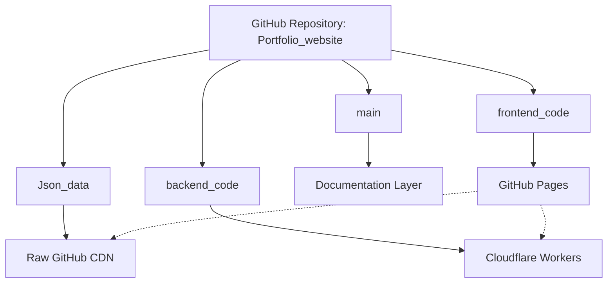
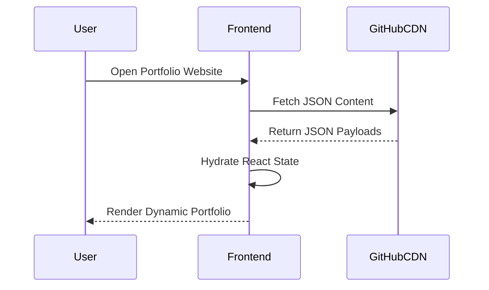
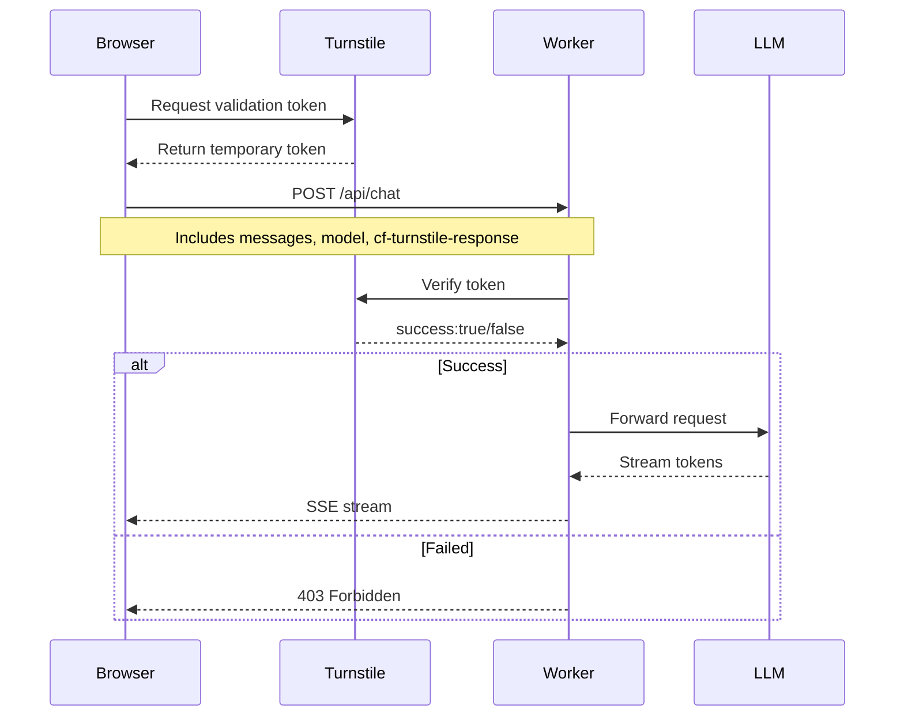
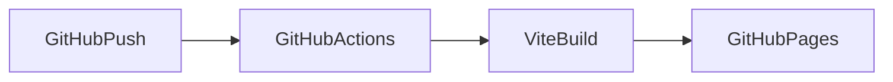
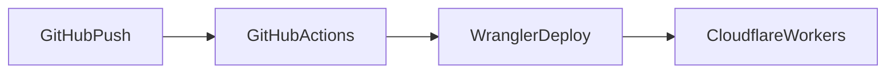

# 🏛️ System Architecture: AI-Powered Multi-Branch Serverless Portfolio Platform

This document defines the complete architecture, deployment strategy, runtime flow, security model, CI/CD pipeline, and operational behavior of the AI-powered personal portfolio ecosystem.

The system is designed with the following goals:

* ✅ 100% Free Hosting
* ✅ Fully Serverless Infrastructure
* ✅ Dynamic Runtime Content Updates
* ✅ Secure AI Gateway Protection
* ✅ Production-grade Streaming AI Chat
* ✅ Git-as-a-CMS Architecture
* ✅ Zero Database Dependency
* ✅ Branch-Isolated Modular Development
* ✅ Automatic CI/CD Deployment
* ✅ Bot & Abuse Protection
* ✅ Edge-Native Global Distribution

---

# 📂 1. Repository Architecture

The project follows a **multi-branch mono-repository architecture** where each branch represents an independent subsystem.



---

# 🌿 Branch Breakdown

---

# 🔹 `main`

## Purpose

Central orchestration branch.

Contains:

* Documentation
* Architecture diagrams
* Setup instructions
* Deployment guides
* Contribution rules
* Repository metadata

## Files

```txt
README.md
ARCHITECTURE.md
LICENSE
```

---

# 🔹 `frontend_code`

## Purpose

Frontend SPA application.

## Technology Stack

| Layer      | Technology      |
| ---------- | --------------- |
| Framework  | React 19        |
| Build Tool | Vite            |
| Language   | TypeScript      |
| Routing    | TanStack Router |
| State/Data | TanStack Query  |
| Styling    | TailwindCSS     |
| Animation  | Framer Motion   |
| Markdown   | MDX             |
| Deployment | GitHub Pages    |

---

## Deployment URL

```txt
https://rathoreatri03.github.io/Portfolio_website/
```

---

## Responsibilities

* Render dynamic portfolio
* Fetch runtime JSON content
* AI chat UI
* Turnstile token generation
* Streaming SSE rendering
* Interactive portfolio sections
* Resume rendering
* Dynamic skill/project hydration

---

# 🔹 `backend_code`

## Purpose

AI middleware + security gateway.

---

## Technology Stack

| Layer      | Technology               |
| ---------- | ------------------------ |
| Runtime    | Cloudflare Workers       |
| Framework  | Hono                     |
| Language   | TypeScript               |
| Security   | Cloudflare Turnstile     |
| Streaming  | Server Sent Events (SSE) |
| Deployment | Wrangler                 |

---

## Deployment URL

```txt
https://dodo-ai-agent.dodoai.workers.dev
```

---

## Responsibilities

* Verify Turnstile tokens
* Prevent abuse/spam
* Protect LLM API keys
* Forward requests to LLM providers
* Stream AI responses
* CORS validation
* Edge execution
* Request filtering
* Security enforcement

---

# 🔹 `Json_data`

# The Git-as-a-CMS Engine

This branch acts as a fully serverless headless CMS.

No database exists.

All content is stored as version-controlled JSON files.

---

# 📦 Example Structure

```txt
Json_data/
│
├── banner.json
├── skills.json
├── projects.json
├── experiences.json
├── certifications.json
├── social_links.json
├── research.json
├── metadata.json
└── resume.json
```

---

# 🌐 Runtime Data Source

Frontend dynamically loads:

```txt
https://raw.githubusercontent.com/Rathoreatri03/Portfolio_website/Json_data/
```

Example:

```txt
https://raw.githubusercontent.com/Rathoreatri03/Portfolio_website/Json_data/projects.json
```

---

# ✅ Major Advantage

You can update:

* skills
* projects
* experience
* links
* resume
* research papers

WITHOUT:

* rebuilding frontend
* redeploying site
* restarting worker

The frontend updates instantly after GitHub CDN refresh.

---

# 🔄 2. Runtime Architecture

---

# A. Dynamic CMS Runtime Flow



---

# 🌍 CDN Advantage

GitHub raw content is globally cached.

Benefits:

* ultra-low latency
* zero backend cost
* edge delivery
* automatic caching

---

# 🤖 B. AI Streaming Chat Runtime Flow



---

# ⚡ 3. SSE Streaming Architecture

The AI system uses:

# Server Sent Events (SSE)

instead of polling.

---

# Flow

```txt
LLM Token
↓
Cloudflare Worker
↓
ReadableStream
↓
Frontend Stream Reader
↓
Live Token Rendering
```

---

# Benefits

| Feature            | Benefit                   |
| ------------------ | ------------------------- |
| Token Streaming    | Real-time AI typing       |
| Lower Latency      | Faster perceived response |
| Edge Streaming     | Global performance        |
| Lower Memory Usage | Incremental rendering     |

---

# 🛡️ 4. Security Architecture

---

# A. Cloudflare Turnstile

Turnstile protects the AI API from:

* curl abuse
* bot scraping
* automated spam
* API draining
* credit exhaustion
* malicious scripts

---

# B. Frontend Token Lifecycle

Implemented in:

```txt
src/components/dodo/DodoAI.tsx
```

---

# Flow

## 1. Invisible Widget

```html
<div id="dodo-turnstile"></div>
```

---

## 2. Token Generated

Browser automatically receives:

```txt
0.xxxxxxxxxxxxxxxxx
```

---

## 3. Token Sent

```http
cf-turnstile-response: TOKEN
```

---

## 4. Token Reset

After each request:

```js
turnstile.reset()
```

Prevents replay attacks.

---

# 🚨 Important Security Distinction

| Value      | Purpose                         |
| ---------- | ------------------------------- |
| Site Key   | Public frontend key             |
| Secret Key | Backend verification key        |
| Token      | Temporary user validation proof |

---

# ❌ Common Mistake

Sending:

```txt
TURNSTILE_SECRET_KEY
```

as:

```http
cf-turnstile-response
```

This is invalid.

Only browser-generated tokens work.

---

# 🔐 Backend Verification

Implemented in:

```txt
src/index.ts
```

---

# Verification Request

```http
POST https://challenges.cloudflare.com/turnstile/v0/siteverify
```

---

# Payload

```txt
secret=SECRET_KEY
response=TOKEN
```

---

# Allowed Origins

CORS protection allows ONLY:

```txt
https://rathoreatri03.github.io
http://localhost:5173
```

---

# 🚀 5. Deployment Architecture

---

# Frontend Deployment



---

# Backend Deployment



---

# 📦 6. Environment Variables

---

# Local Development

Uses official Cloudflare testing credentials.

---

# `.dev.vars`

```env
TURNSTILE_SECRET_KEY=xxxxxxxxxxxxxxxxxxxxxxxxxxxxxxxxxxx
GENAI_API_KEY=your_key_here
```

---

# Frontend Test Site Key

```txt
xxxxxxxxxxxxxxxxxxxxxxxxxxxxxxxx
```

Auto passes verification.

---

# Production Setup

---

# Frontend

Inside:

```txt
DodoAI.tsx
```

Set:

```js
sitekey: "YOUR_PRODUCTION_SITE_KEY"
```

---

# Backend

Cloudflare Dashboard:

```txt
Workers & Pages
→ Worker
→ Settings
→ Variables & Secrets
```

Add:

```txt
TURNSTILE_SECRET_KEY
GENAI_API_KEY
```

---

# 🧪 7. Local Testing Strategy

---

# Node Diagnostic Script

```txt
test-stream.js
```

Simulates:

* streaming
* SSE parsing
* AI responses
* token handling

---

# ⚠ Why Direct Node Requests Fail

Node cannot generate Turnstile tokens.

Only browsers can.

So this fails:

```http
cf-turnstile-response: SECRET_KEY
```

because secret keys are NOT tokens.

---

# ✅ Correct Local Development Strategy

Add development bypass:

```js
if (env.ENVIRONMENT === "development") {
   skipTurnstile = true;
}
```

OR:

```js
if (request.headers.get("x-debug") === "true") {
   bypass = true;
}
```

---

# 🧠 8. Recommended Worker Security Enhancements

---

# Rate Limiting

Recommended:

```txt
IP-based throttling
```

using:

* Durable Objects
* KV
* Upstash Redis

---

# Request Validation

Validate:

* message length
* token count
* request body size
* allowed models

---

# Abuse Detection

Block:

* rapid repeated requests
* malformed JSON
* bot headers
* invalid origins

---

# 📊 9. Infrastructure Cost Breakdown

| Component     | Provider             | Cost |
| ------------- | -------------------- | ---- |
| Frontend      | GitHub Pages         | $0   |
| CMS/Data      | GitHub Raw CDN       | $0   |
| Backend       | Cloudflare Workers   | $0   |
| Security      | Cloudflare Turnstile | $0   |
| CI/CD         | GitHub Actions       | $0   |
| Edge Delivery | Cloudflare Edge      | $0   |

---

# 🔥 10. Core Architectural Advantages

| Feature                   | Benefit              |
| ------------------------- | -------------------- |
| Multi-branch architecture | Isolated systems     |
| Git-as-CMS                | No database needed   |
| Edge Workers              | Global low latency   |
| SSE Streaming             | Real-time AI         |
| Turnstile                 | Bot protection       |
| GitHub Pages              | Free hosting         |
| Runtime JSON              | Instant updates      |
| Serverless backend        | Infinite scalability |
| Cloudflare Edge           | High availability    |

---
