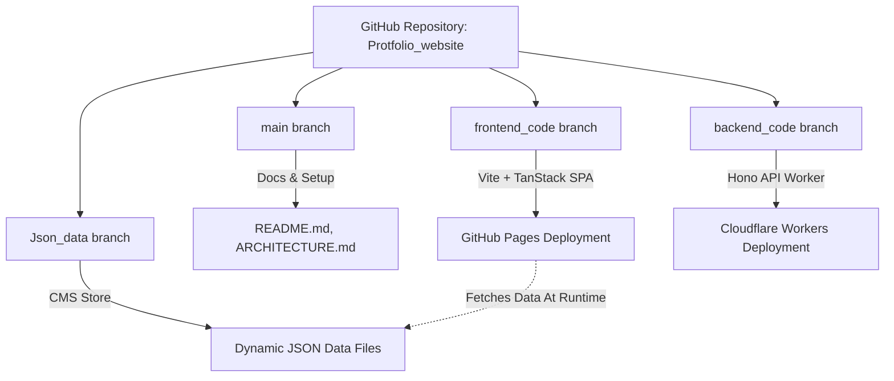
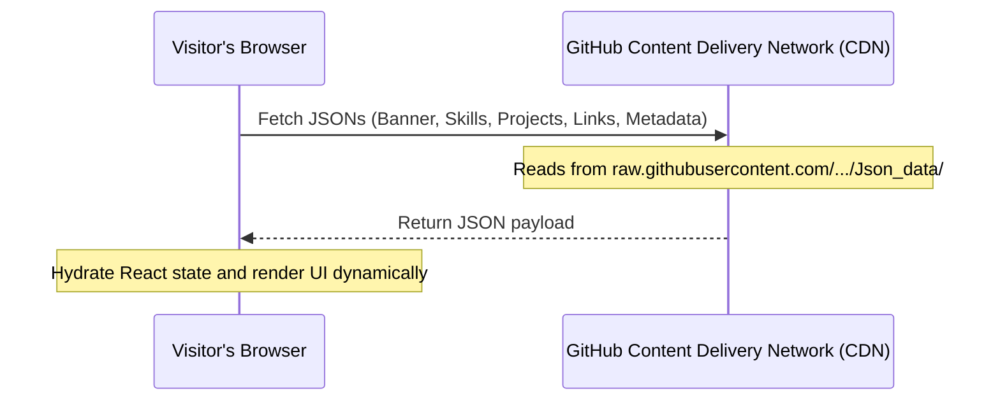
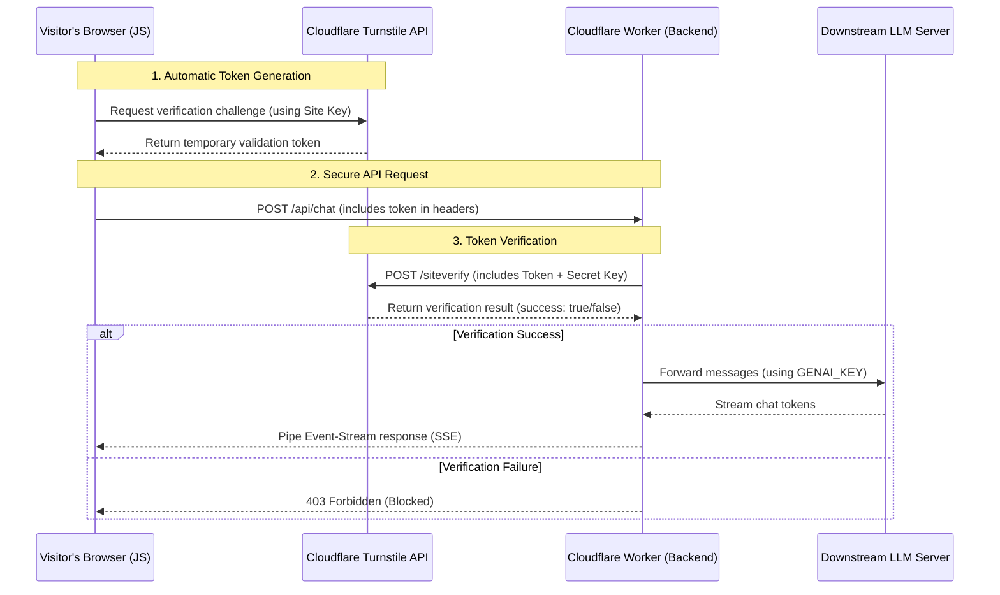

# 🏛️ System Architecture: Multi-Branch Serverless Portfolio

This document outlines the architecture, data flow, and deployment strategy of your AI-powered personal portfolio. This system is designed to be **100% free to host** while maintaining robust security and dynamic content updates without redeployments.

---

## 📂 1. Multi-Branch Repository Architecture

The project leverages a **multi-branch Git structure** where different branches represent distinct components of the system. This separation isolates codebases (Frontend vs. Backend) and separates code from content/data.

### 🔹 `main` Branch
* **Role**: Documentation, orchestration, and general repository entrypoint.
* **Key files**: [README.md](file:///d:/Persnol/protfolio/main/README.md), [ARCHITECTURE.md](file:///d:/Persnol/protfolio/main/ARCHITECTURE.md).
* **Usage**: Guides users on how the system is set up and deployed.

### 🔹 `frontend_code` Branch
* **Role**: The portfolio's user interface.
* **Stack**: React (v19), Vite, TypeScript, TailwindCSS, TanStack Router/Query.
* **Deployment**: Automatically built via GitHub Actions and published to **GitHub Pages** (`https://rathoreatri03.github.io/Portfolio_website/`).

### 🔹 `backend_code` Branch
* **Role**: Serverless API middleware (proxy) and security layer.
* **Stack**: TypeScript, Hono (ultra-lightweight web framework), Cloudflare Wrangler.
* **Deployment**: Deployed via GitHub Actions directly to **Cloudflare Workers** (`https://dodo-ai-agent.dodoai.workers.dev`).

### 🔹 `Json_data` Branch (The "Git-as-a-CMS" Engine)
* **Role**: Dynamic content database.
* **Files**: JSON files containing projects, experiences, skills, research, and profile links.
* **Mechanism**: The frontend does not hardcode data. Instead, it queries the raw GitHub raw content URLs (`https://raw.githubusercontent.com/Rathoreatri03/Portfolio_website/Json_data/`) dynamically on page load.
* **Benefit**: You can edit your skills, projects, or resume in the JSON files directly on GitHub, and your website updates **instantly** without needing a code rebuild or redeployment!

---

## 🔄 2. Dynamic Runtime Data Flow

The runtime data flow is divided into two parts: **Dynamic Portfolio Content Loading** (CMS) and **Secured AI Agent Streaming Chat**.

### A. Portfolio Content Load (CMS Flow)

### B. Secured DODO AI Agent Chat Flow (Security Layer)
To protect your Generative AI credits, requests are verified using **Cloudflare Turnstile** to block automated scripts (e.g. cURL, Python, scraping bots) from spamming the `/api/chat` API.

---

## 🛡️ 3. Security Implementation Details

### Frontend Token Lifecycle
* Implemented in [DodoAI.tsx](file:///d:/Persnol/protfolio/AI-Portfolio_frontend/src/components/dodo/DodoAI.tsx).
* A hidden container `

` is rendered.
* Turnstile generates an invisible validation token automatically. When a user submits a prompt, this token is sent via the header:
  `cf-turnstile-response: <TOKEN>`
* After sending, the token is reset to ensure single-use replay protection.

### Backend Validation Check
* Implemented in [index.ts](file:///d:/Persnol/protfolio/AI-Portfolio_backend/src/index.ts).
* Reads `cf-turnstile-response` and validates it with Cloudflare via standard form POST to `/siteverify`.
* CORS checks are enforced dynamically, allowing only your official GitHub Pages URL and `localhost` during development.

---

## 💸 4. Zero-Cost Infrastructure ($0 Hosting Guide)

This architecture allows anyone to deploy and run this production-grade, AI-powered system for **completely free**:

| Component | Provider | Free Tier Threshold | Actual Cost |
|:---|:---|:---|:---|
| **Frontend Hosting** | GitHub Pages | Unlimited bandwith for public repositories | **$0** |
| **Database / CMS** | GitHub Files | CDN-backed raw file access | **$0** |
| **API Middleware** | Cloudflare Workers | 100,000 requests per day | **$0** |
| **Bot Protection** | Cloudflare Turnstile | Unlimited invisible challenges | **$0** |
| **CI/CD Pipeline** | GitHub Actions | 2,000 build minutes per month | **$0** |

---

## 🛠️ 5. Setting up Environment Variables

### Local Development (Dev Mode)
Local dev uses Cloudflare's official testing keys, allowing instant offline testing:
* **Site Key (Frontend)**: `1x00000000000000000000BB` (Automatic pass)
* **Secret Key (Backend)**: `1x0000000000000000000000000000000AA` (Automatic pass, defined in [.dev.vars](file:///d:/Persnol/protfolio/AI-Portfolio_backend/.dev.vars))
* **Test Token (test-stream.js)**: `1x0000000000000000000000000000000AA` (Defined in [.dev.vars](file:///d:/Persnol/protfolio/AI-Portfolio_backend/.dev.vars))

### Production Keys
1. Create an invisible Turnstile widget in the **Cloudflare Turnstile Dashboard** for `rathoreatri03.github.io`.
2. Save your production **Site Key** inside [DodoAI.tsx](file:///d:/Persnol/protfolio/AI-Portfolio_frontend/src/components/dodo/DodoAI.tsx#L87).
3. Save your production **Secret Key** as `TURNSTILE_SECRET_KEY` inside your Cloudflare Worker Dashboard under **Settings -> Variables and Secrets -> Add Secret**.
